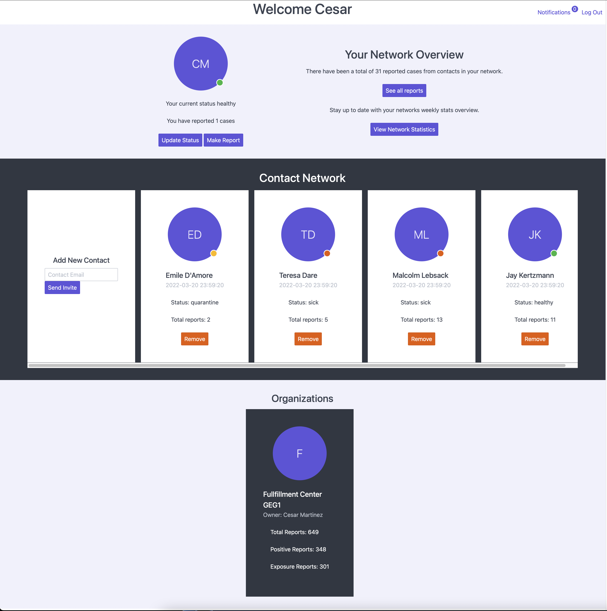
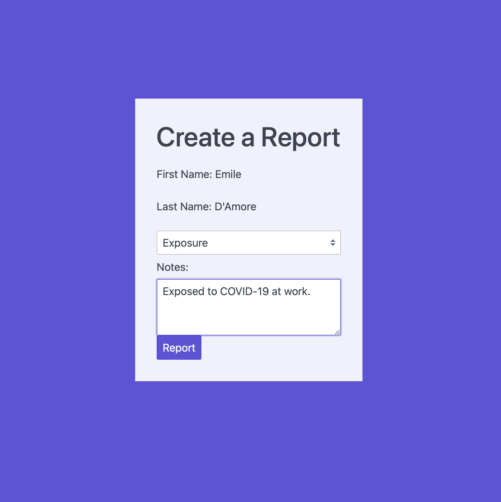
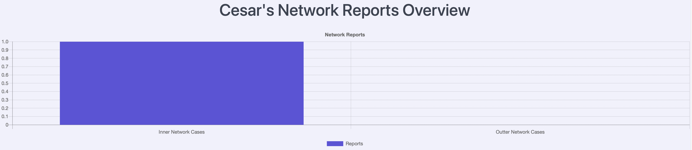
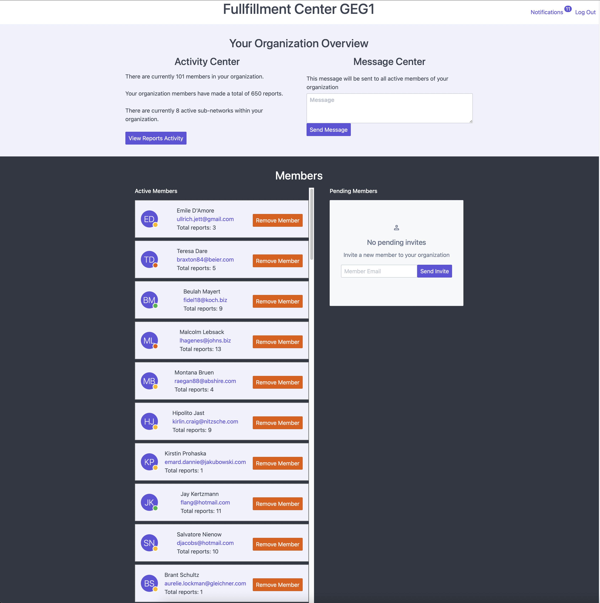
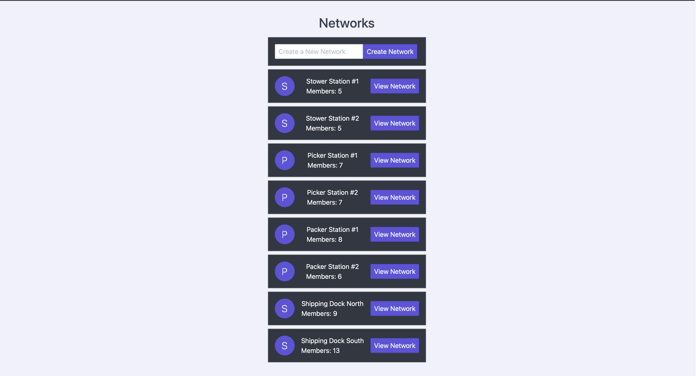
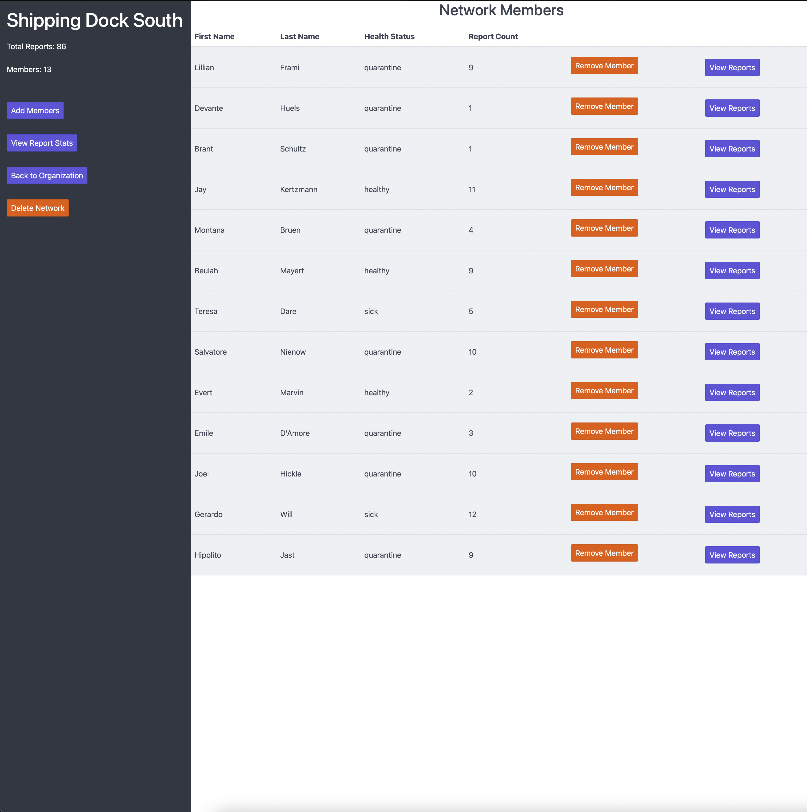
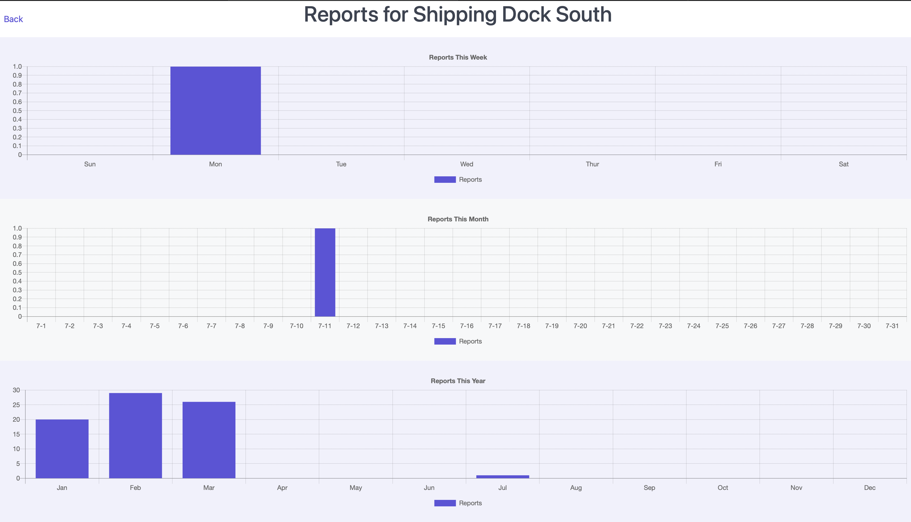

# Trackr 

## About This Project
Trackr was a senior capstone project completed over multiple sprints using the AGILE methodology. Our idea was to find a way to improve the efficiency of contact tracing. When we started, we had a few ideas for the project. We decided to create a web application that would allow users to add contacts to their network to be notified when the user reports a case. We also wanted to find a solution for tracking these cases in a bigger setting like schools or workplaces.

## My Contributions

- Created the database schema

- Implemented the models and controllers

- Implemented notification system

## Our Goals

- To Create a faster and more efficient method for people to inform their friends, family, or colleagues that they have tested positive or have been exposed to COVID-19. 

- Find a solution that does not require tracking users locations and instead encourages transparency 

- Present data to users that has real meaning  

## Our Solutions

- We created a web application that allows users to add contacts to their network to be notified when the user reports a case. In addition, users can sign up as an organization which allows for tracking of cases in a larger setting. Subnetworks allows an organization to be broken up into smaller sections representing different rooms or departments. Cases can then be analyzed individually at a smaller more relevant scale.

- To promote transparency users have access to data about their network and the organizations they are a part of and can see the number of cases that have been reported.

- The data presented to users pertains to the contacts and organizations they are a part of. This gives users a better understanding of their situation and what precautions they can take to help prevent the spread of COVID-19.

## Project Features 

Here is an overview of the features of the project that helped achieve our goals:

### Users

</img>

- Users can add contacts to their networks to have two way notifications when they report a case.
- Users can make reports and update their health status which is visible to their contacts and organizations.
- Users can accept an organization invitation which will send them a notification when a new case is reported.
- Users have access to a notification center to check up on reports or contact/organization requests. (Notifications also sent by email)

</img>

</img>

- Users can see the number of cases that have been reported by their contacts
- Users can also see the number of reports in their outer network (contacts of contacts)

### Organizations

</img>

- Organizations can send out requests to users to be added to their network.
- Organizations can message all users in their network to potentially give updates on COVID-19 guidelines.
- Organizations also have access to stats about the number of cases that have been reported by all members of the organization.

</img>

- Subnetworks are a useful feature within large orgnanizations to break up the network into smaller pieces.

</img>

</img>

- Subnetworks isolate stats to reports made only by people in the subnetwork which helps analyze the data at a closer level and potentially help spot a spread of COVID-19 sooner.

## Tools Used

- Laravel
- SQLite
- Spectre.css
- TailwindCSS
- Chartisan/Chart.js
